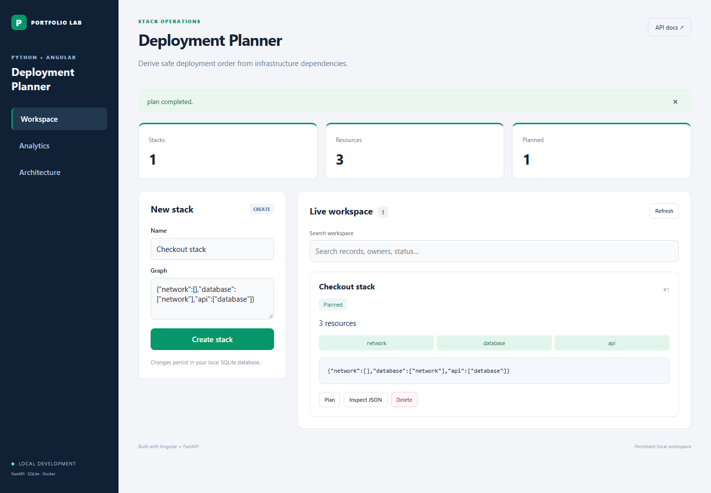

# Deployment Planner — Python + Angular

Derive safe deployment order from infrastructure dependencies.

**Skills:** Dependency graph modeling, topological sort, cycle detection, infrastructure planning.

**Stack:** Python 3.11+, FastAPI, Angular 21, TypeScript, RxJS, SQLite, Docker, Kubernetes, GitHub Actions.

## Screenshots



[View the mobile dashboard](docs/mobile.png).

## Run locally

Requires Python 3.11+ and Node.js 20.19+, 22.12+, or 24+. Package installation requires internet; no cloud account is required.

```sh
python -m venv .venv
# Windows PowerShell:
.venv/Scripts/Activate.ps1
# macOS/Linux instead: source .venv/bin/activate
python -m pip install -r requirements-dev.txt
cd frontend
npm ci
npm run build
cd ..
python run.py
```

Open http://127.0.0.1:8120. API documentation is at `/docs`. For Angular live reload, keep Python running and use `npm start` in `frontend/`, then open http://127.0.0.1:4220.

## Demonstration

Create the prefilled example, then use **plan** to run the main workflow. Use Analytics to inspect metrics and Inspect JSON to see persisted results.

Computes deployment order for JSON resource graphs; it does not execute Terraform or provision infrastructure.

## Architecture

Angular standalone components, signals, typed HttpClient, reactive forms, and debounced search → FastAPI → project-specific `domain.py` → transactional SQLite storage.

This repo is independent; its `domain.py` implements the business rules for this project. The UI and infrastructure share the portfolio foundation. Writes and any external HTTP checks are serialized in a single process. Records persist under `data/`.

| Endpoint | Purpose |
| --- | --- |
| GET /health | Database health |
| GET /metrics | Prometheus record gauge |
| GET /api/config | Project form schema |
| GET /api/records?q=text | List and filter |
| POST /api/records | Validate and create |
| POST /api/records/id/action | Domain-specific workflow |
| DELETE /api/records/id | Delete |
| GET /api/summary | Project analytics |

Example JSON:

```json
{
  "name": "Checkout stack",
  "graph": "{\"network\":[],\"database\":[\"network\"],\"api\":[\"database\"]}"
}
```

## Testing and DevOps

Local verification completed: eight Python tests, strict production Angular compilation, and browser checks for creation, workflows, filtering, analytics, mobile layout, and deletion. Screenshot fixtures use a disposable database. Docker Compose configuration validation passed; container execution is checked by GitHub CI.

```sh
python -m unittest -v
cd frontend
npm run build
cd ..
docker compose up --build
```

Tests cover business invariants, failure cases, HTTP requests, persistence, metrics, and custom routes. Angular builds enforce strict templates and TypeScript. GitHub Actions runs tests and builds Angular and Docker. Compose preserves a named data volume; `docker compose down --volumes` deletes its contents.

The non-root multi-stage container serves Angular and FastAPI together. Kubernetes templates include PVC storage, resource limits, probes, and a single-replica deployment. Replace the local image name before using a cluster. No live cloud deployment is claimed.

`HOST`, `PORT`, and `DATABASE_PATH` configure the backend. When overriding `PORT`, update the frontend proxy. The local demo has no authentication or TLS; add those before public hosting. Use one backend process.
